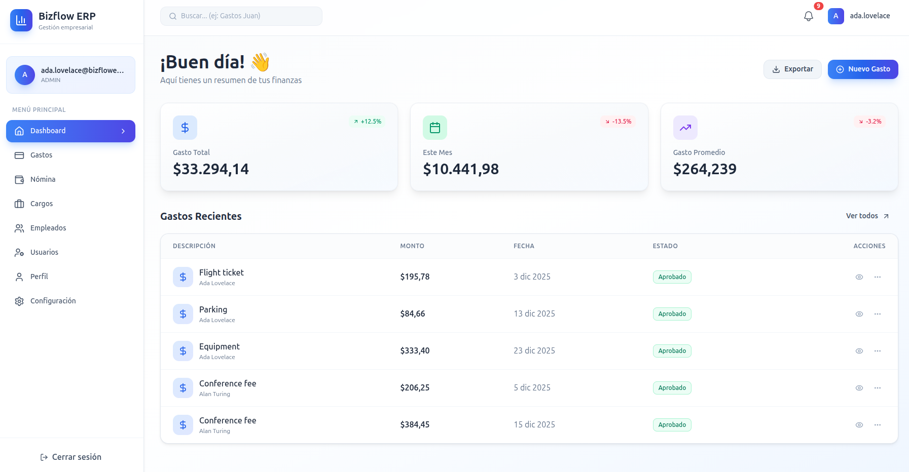
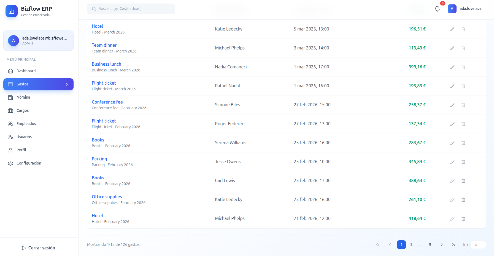
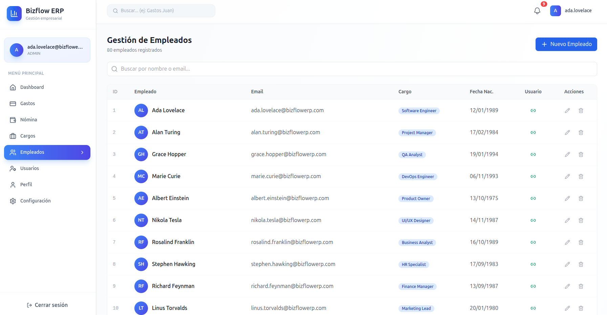
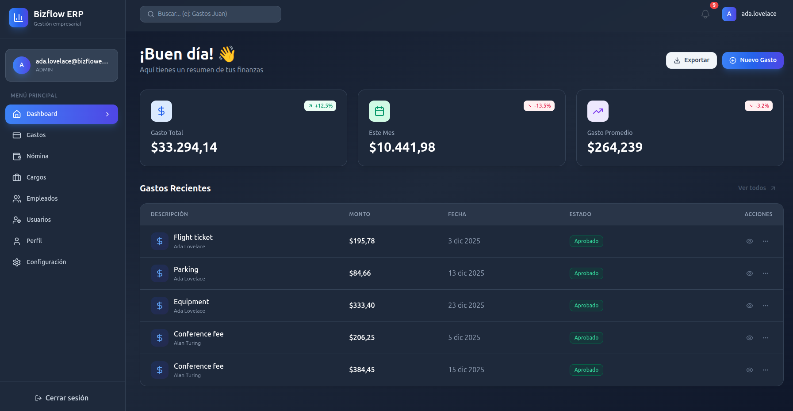
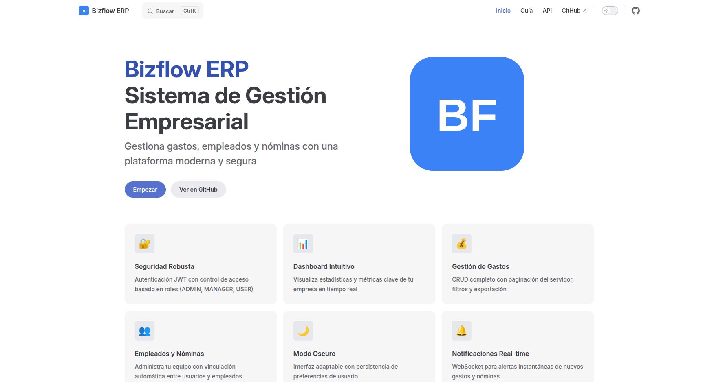
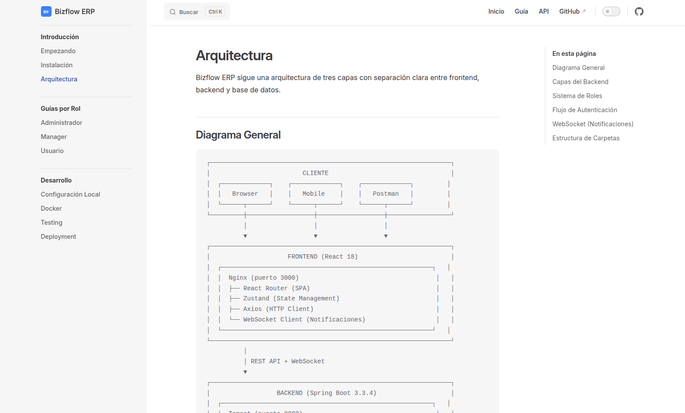
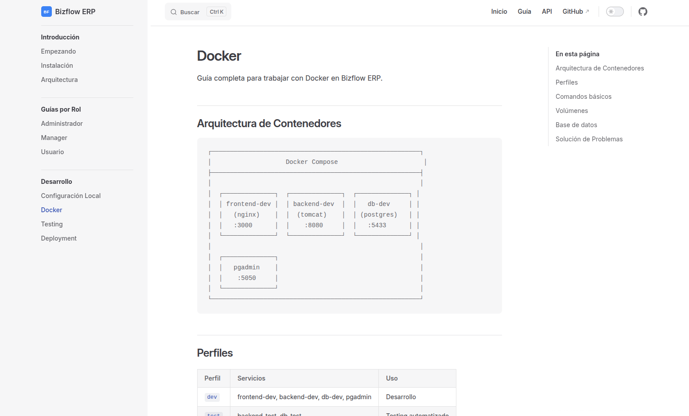
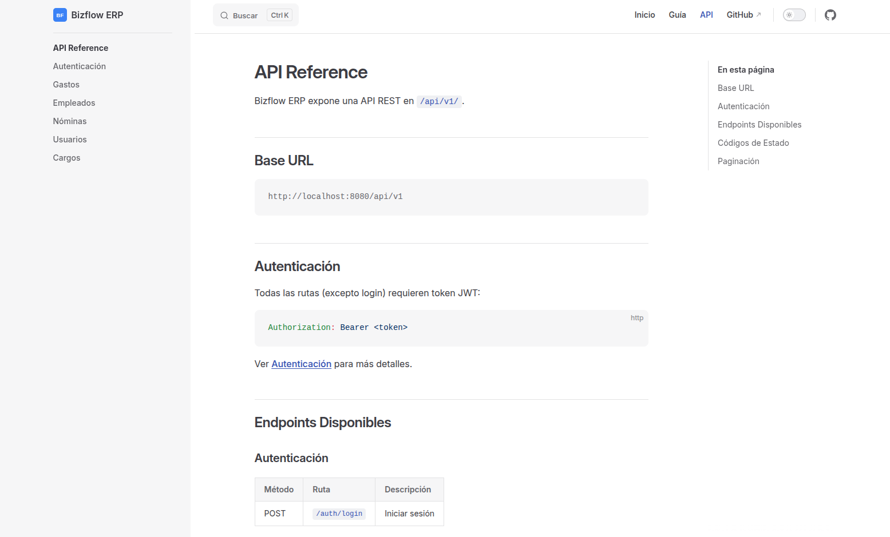

# Bizflow ERP

[](https://spring.io/projects/spring-boot)
[](https://reactjs.org/)
[](https://openjdk.org/)
[](https://www.postgresql.org/)
[](https://docs.docker.com/compose/)
[](LICENSE.txt)

Sistema ERP moderno para gestión de gastos empresariales, empleados y nóminas.

## 📸 Screenshots

<table>
  <tr>
    <td align="center"><strong>Dashboard</strong></td>
    <td align="center"><strong>Gastos</strong></td>
  </tr>
  <tr>
    <td></td>
    <td></td>
  </tr>
  <tr>
    <td align="center"><strong>Empleados</strong></td>
    <td align="center"><strong>Modo Oscuro</strong></td>
  </tr>
  <tr>
    <td></td>
    <td></td>
  </tr>
</table>

## ✨ Características

- 🔐 **Autenticación JWT** con control de acceso basado en roles (ADMIN, MANAGER, USER)
- 📊 **Dashboard** con estadísticas y gráficos
- 💰 **Gestión de Gastos** con paginación del lado del servidor
- 👥 **Empleados y Nóminas** con vinculación a usuarios
- 🌙 **Modo Oscuro** con persistencia de preferencias
- 🔔 **Notificaciones en tiempo real** via WebSocket
- 📱 **Diseño responsive** para móvil y escritorio

## 🚀 Quick Start

### Prerrequisitos

- Docker y Docker Compose
- Git

### Instalación

```bash
# Clonar el repositorio
git clone https://github.com/jdomdev/bizflow-erp-springboot-react-docker.git
cd bizflow-erp-springboot-react-docker

# Iniciar en modo desarrollo
make dev

# O con docker compose directamente
docker compose --profile dev up -d
```

### Acceso

| Servicio | URL | Credenciales |
|----------|-----|--------------|
| Frontend | http://localhost:3000 | - |
| Backend API | http://localhost:8080/api/v1 | - |
| pgAdmin | http://localhost:5050 | Ver `.env` |

Usuario de prueba: `ada.lovelace@bizflowerp.com`

## 📖 Documentación

[](https://bizflowerp.netlify.app) **[Documentación completa desplegada en Netlify →](https://bizflowerp.netlify.app)**

<table>
  <tr>
    <td align="center"><strong>Home</strong></td>
    <td align="center"><strong>Arquitectura</strong></td>
  </tr>
  <tr>
    <td></td>
    <td></td>
  </tr>
  <tr>
    <td align="center"><strong>Guía Docker</strong></td>
    <td align="center"><strong>API Reference</strong></td>
  </tr>
  <tr>
    <td></td>
    <td></td>
  </tr>
</table>

O localmente en la carpeta [`/docs`](./docs/):
- [Índice de documentación](./docs/INDEX.md)
- [Guía de desarrollo](./docs/guides/DEVELOPMENT_GUIDELINES.md)
- [Comandos Makefile](./docs/makefile/makefile_commands_reference.md)

## 🛠️ Stack Tecnológico

| Backend | Frontend | Infraestructura |
|---------|----------|-----------------|
| Spring Boot 3.3.4 | React 18 | Docker Compose |
| Spring Security + JWT | Vite 5 | PostgreSQL 16 |
| JPA/Hibernate | Tailwind CSS | Nginx |
| Maven | Zustand | pgAdmin |

## 📁 Estructura del Proyecto

```
├── backend/          # Spring Boot API
├── frontend/         # React + Vite
├── docker/           # Dockerfiles base
├── scripts/          # Scripts de utilidad
├── sql/              # Migraciones y seeds
├── docs/             # Documentación
└── docker-compose.yml
```

## 🔧 Comandos Útiles

```bash
make dev              # Iniciar entorno desarrollo
make test             # Ejecutar tests
make logs             # Ver logs de servicios
make db-seed          # Poblar base de datos
make stop             # Detener todos los servicios
```

## 🤝 Contribuir

1. Fork del repositorio
2. Crear rama feature (`git checkout -b feat/nueva-funcionalidad`)
3. Commit cambios (`git commit -m 'feat: añadir nueva funcionalidad'`)
4. Push a la rama (`git push origin feat/nueva-funcionalidad`)
5. Abrir Pull Request

## 📄 Licencia

Este proyecto está bajo la Licencia GNU General Public License v3.0 - ver [LICENSE.txt](LICENSE.txt) para más detalles.

---

<p align="center">
  Desarrollado con ☕ y 💻
</p>
